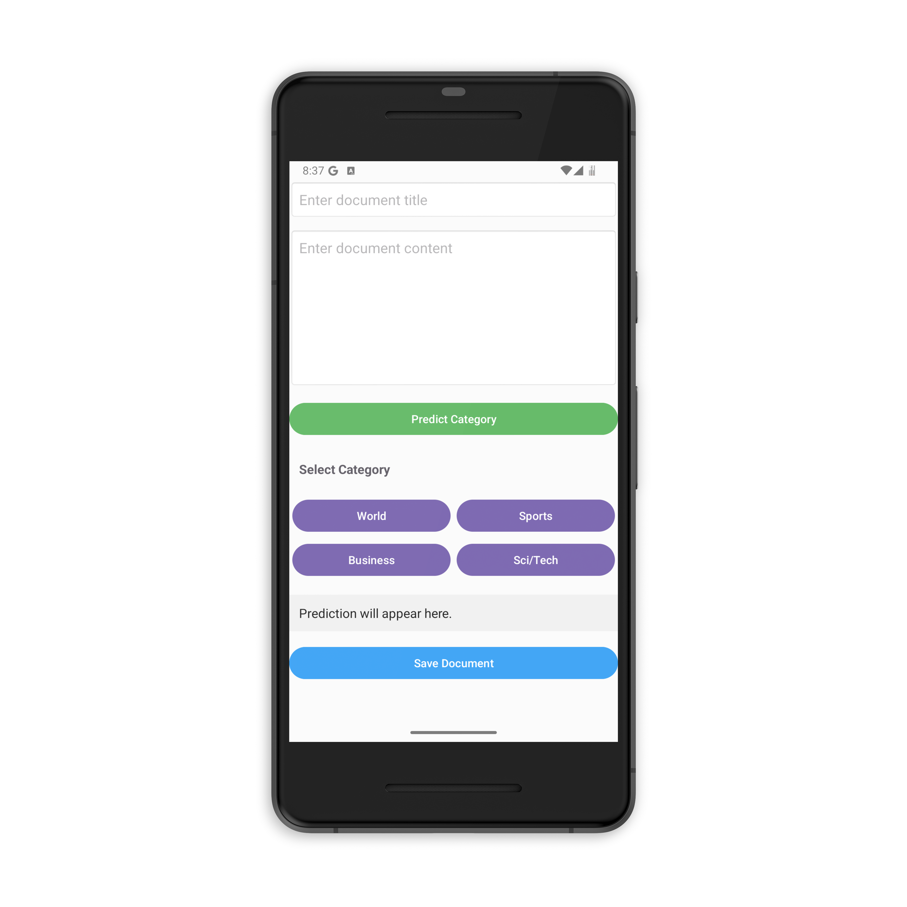
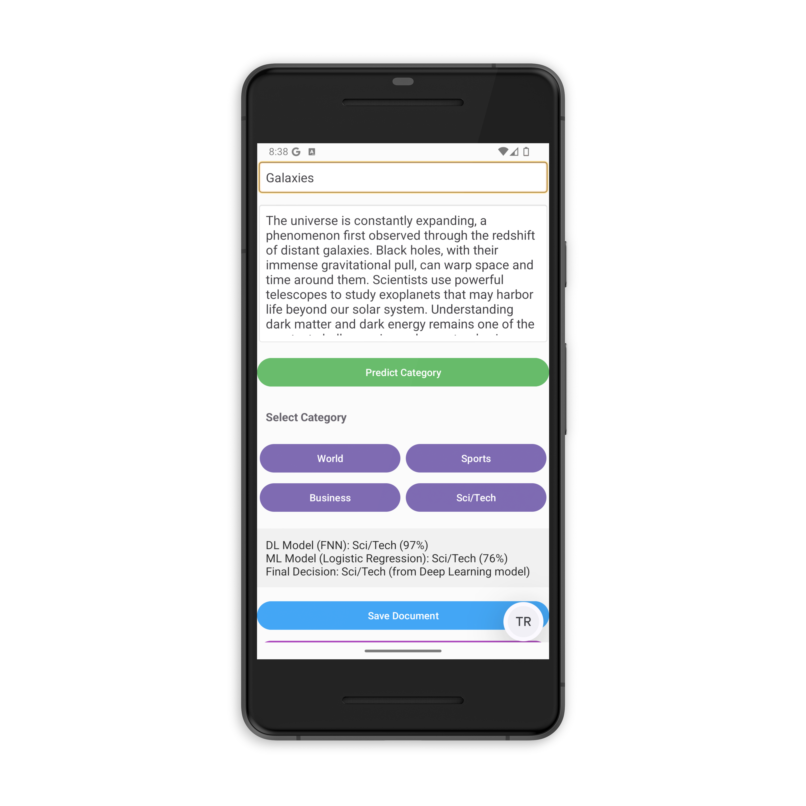
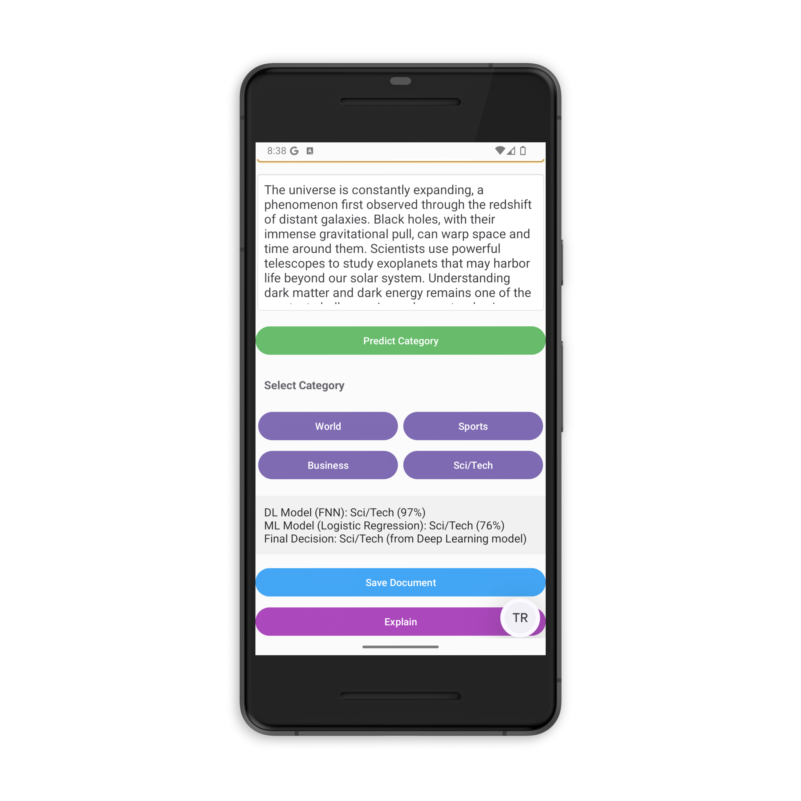
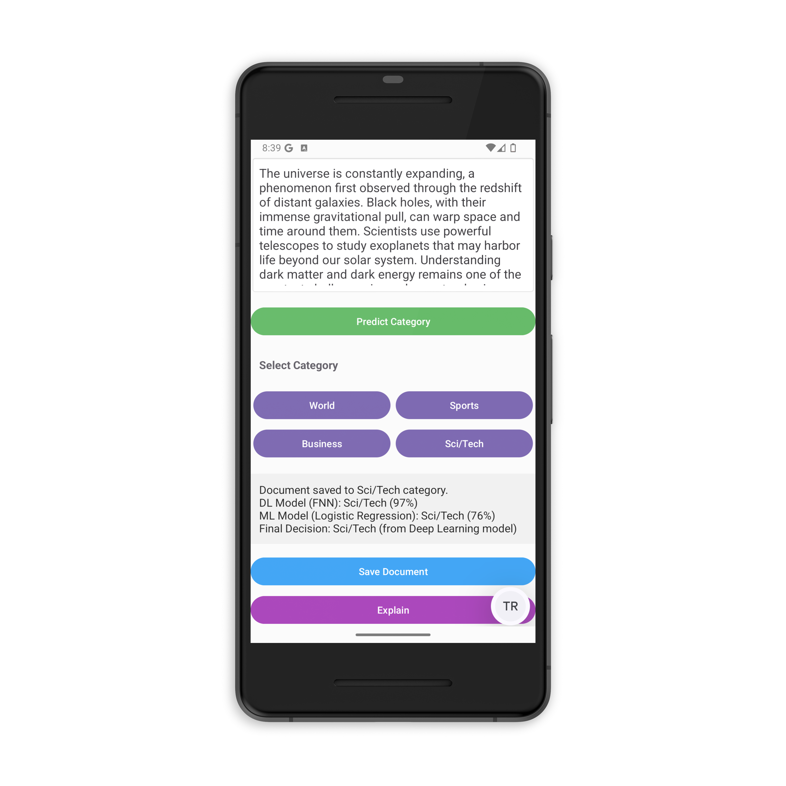
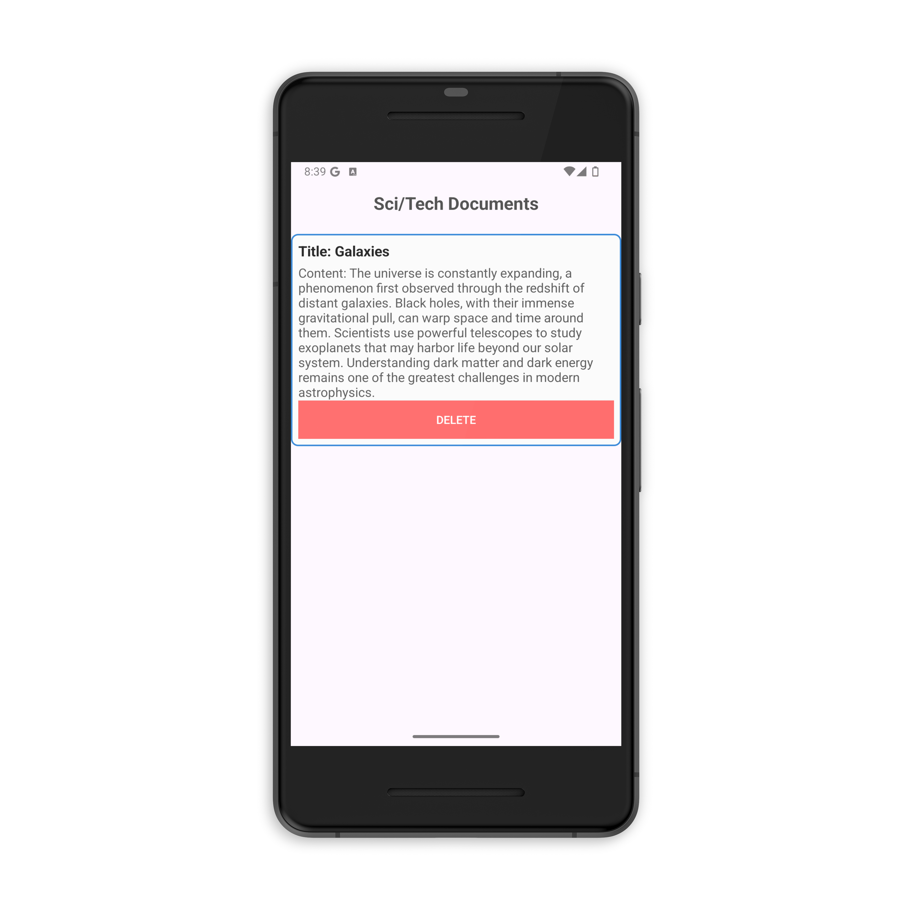
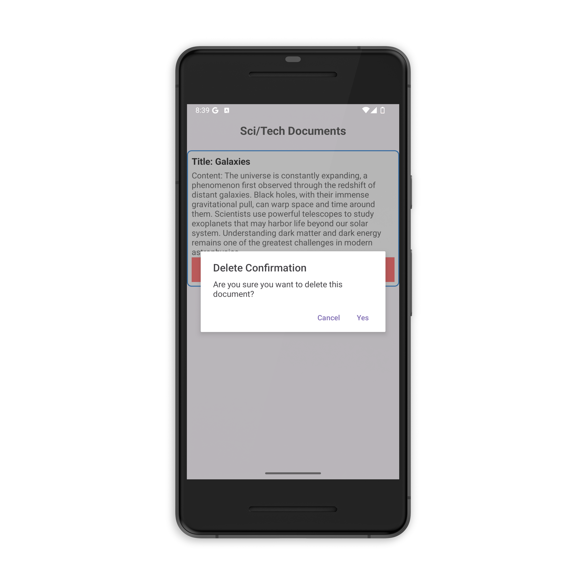
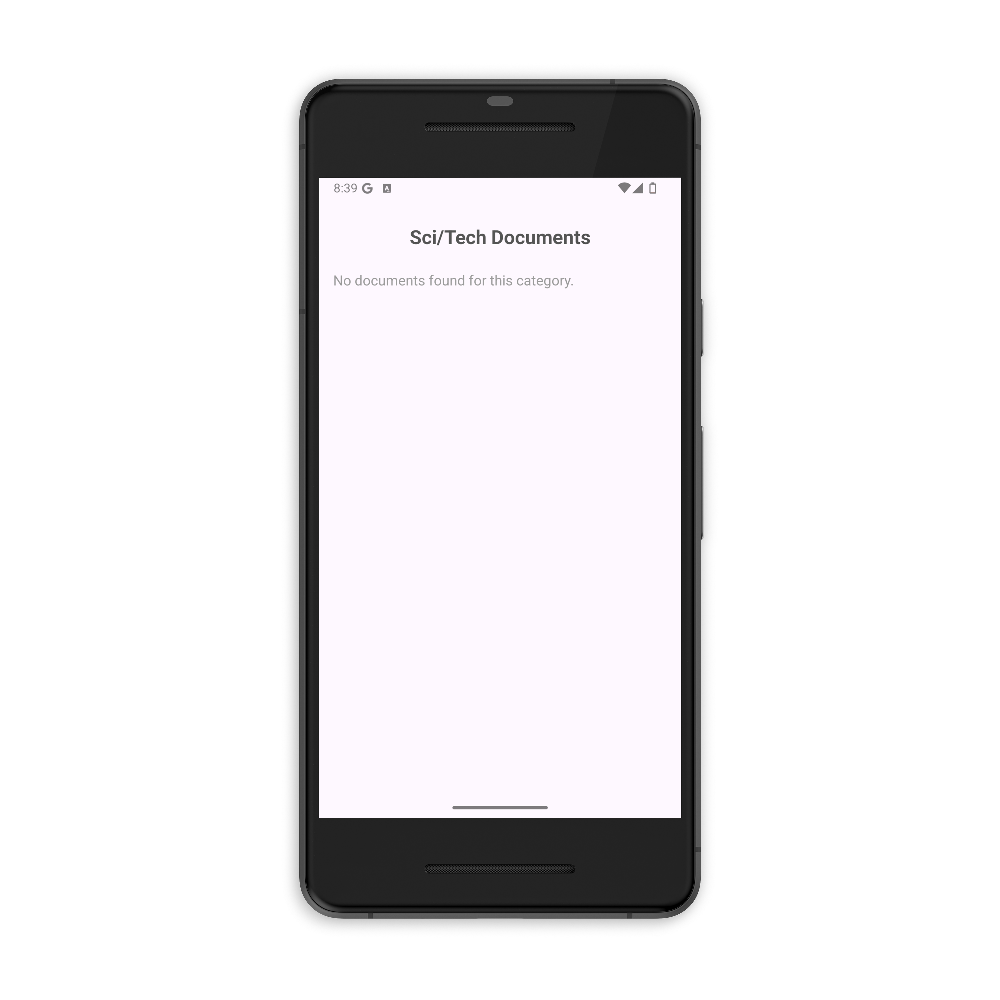
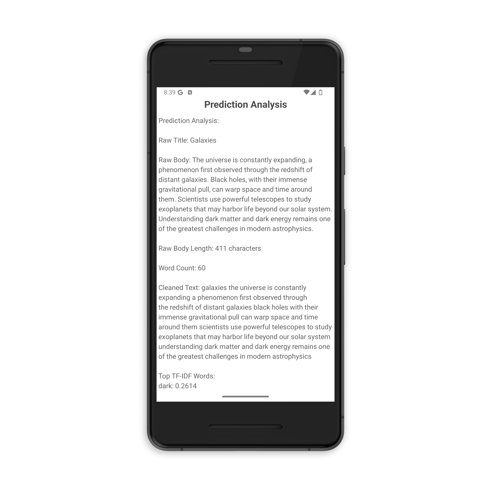
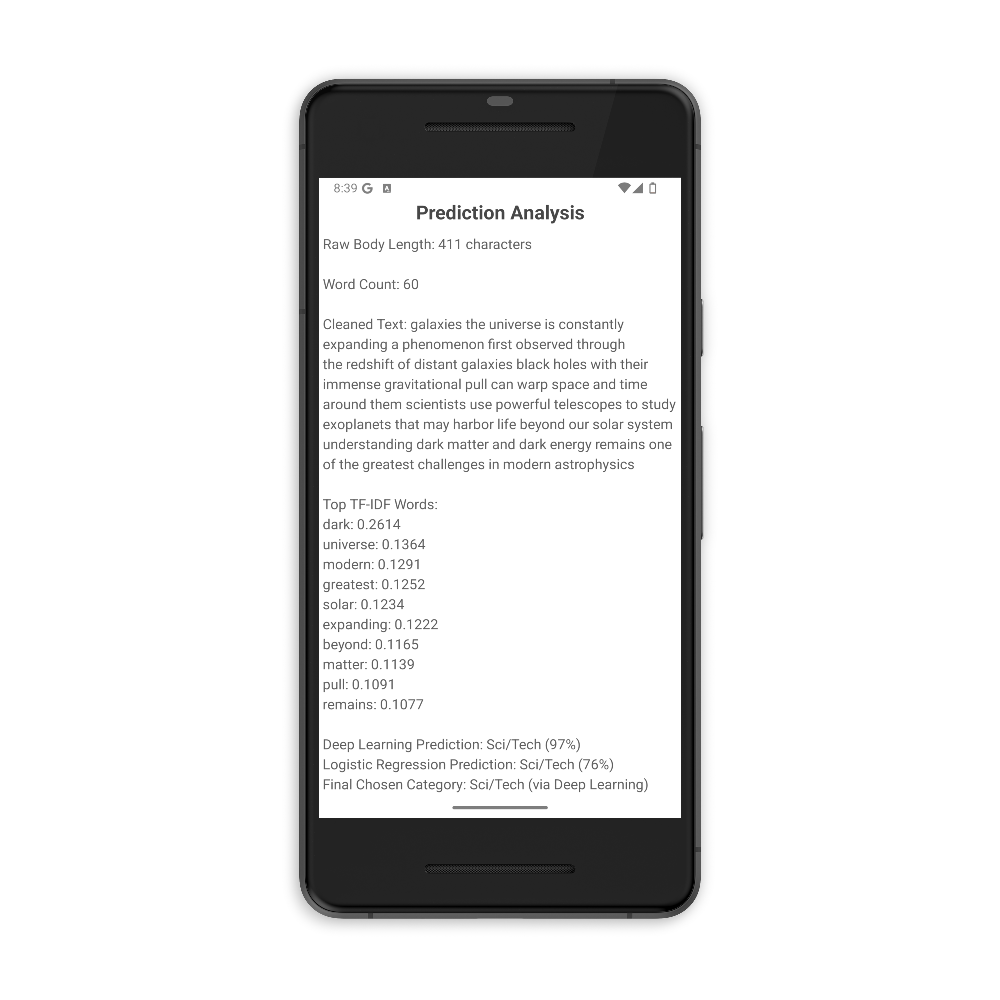

<h1 align="center">:iphone::newspaper:🔍📈SmartTextLibApp - Mobile Text Categorization & Explainable NLP App</h1>

  
  
  
  
  

  SmartTextLib is an AI-powered mobile application designed for text classification, specifically targeting news articles. 
  The app simultaneously utilizes both deep learning and machine learning models to categorize a given text into one of four predefined categories: World, Sports, Business, and Sci/Tech.
  What sets SmartTextLib apart is its dual functionality:

- It serves as an intelligent text categorizer for digital library or media applications.
- It acts as an educational NLP tool, offering users the ability to explore and understand key natural language processing (NLP) steps such as tokenization, TF-IDF vectorization, model inference, and explanation.

  Thanks to the integration of explainable AI (XAI), the app provides detailed insights into how predictions are made, enhancing transparency and user trust. 
  The models are pre-trained and optimized for mobile use via TensorFlow Lite, ensuring fast and efficient on-device performance.

## :camera_flash: Screenshots

<table style="width: 100%; table-layout: fixed;">
  <tr>
    <th style="text-align: center; border: none;">Home Page</th>
    <th style="text-align: center; border: none;">Classification Page</th>
    <th style="text-align: center; border: none;">Text Entry - Prediction Result</th>
  </tr>
  <tr>
    <td style="height: 300px; width: 33.33%; text-align: center; border: none;">
      
    </td>
    <td style="height: 300px; width: 33.33%; text-align: center; border: none;">
      
    </td>
    <td style="height: 300px; width: 33.33%; text-align: center; border: none;">
      
    </td>
  </tr>
  <tr>
    <th style="text-align: center; border: none;">Explain Button</th>
    <th style="text-align: center; border: none;">Save Document</th>
    <th style="text-align: center; border: none;">Category Page</th>
  </tr>
  <tr>
    <td style="height: 300px; width: 33.33%; text-align: center; border: none;">
      
    </td>
    <td style="height: 300px; width: 33.33%; text-align: center; border: none;">
      
    </td>
    <td style="height: 300px; width: 33.33%; text-align: center; border: none;">
      
    </td>
  </tr>
  <tr>
    <th style="text-align: center; border: none;">Delete Document</th>
    <th style="text-align: center; border: none;">Empty Category</th>
    <th style="text-align: center; border: none;">Explainable AI Page - 1</th>
  </tr>
  <tr>
    <td style="height: 300px; width: 33.33%; text-align: center; border: none;">
      
    </td>
    <td style="height: 300px; width: 33.33%; text-align: center; border: none;">
      
    </td>
    <td style="height: 300px; width: 33.33%; text-align: center; border: none;">
      
    </td>
  </tr>
  <tr>
    <th style="text-align: center; border: none;">Explainable AI Page - 2</th>
  </tr>
  <tr>
    <td style="height: 300px; width: 33.33%; text-align: center; border: none;">
      
    </td>
  </tr>
</table>

## :hammer_and_wrench: Technologies
- Android
- Minimum SDK Level 24
- Kotlin
- Python
- NLTK (Natural Language Toolkit)
- Scikit-learn
- Tensorflow / Keras
- Tensorflow Lite (TFLite)
- AG News Dataset
- Explainable AI (XAI)

## How To Run 🚀

1. 📱 Requirements
- Android device (Android 8.0 or higher recommended)
- Android Studio (for building from source)
- Internet connection (only required for downloading the APK or updating resources)
2. 🧠 Using the App
- On the main screen, enter a news headline or text content.
- Tap the "Predict Category" button.
- View classification results from both Machine Learning (Logistic Regression) and Deep Learning models.
- Tap "Explain" to explore the NLP pipeline and explanation for the prediction.
- Use "Educational Mode" to view step-by-step processing like tokenization, TF-IDF, top keywords, and prediction confidence.
3. 🎯 Categories
The app classifies news into the following four categories:
- World
- Sports
- Business
- Sci/Tech
